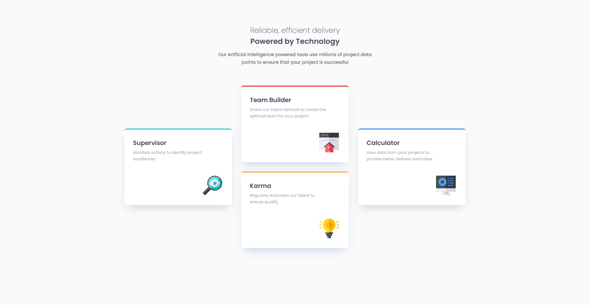
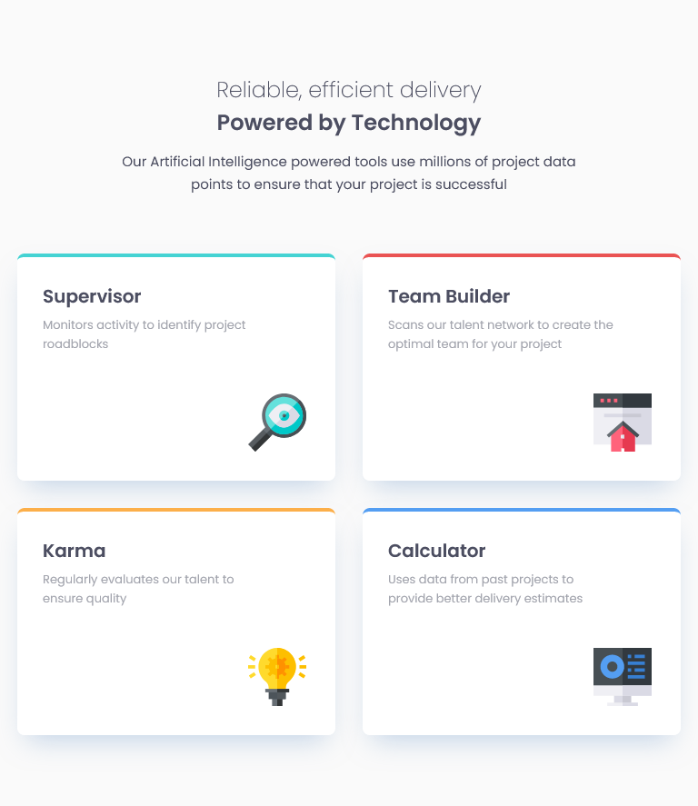
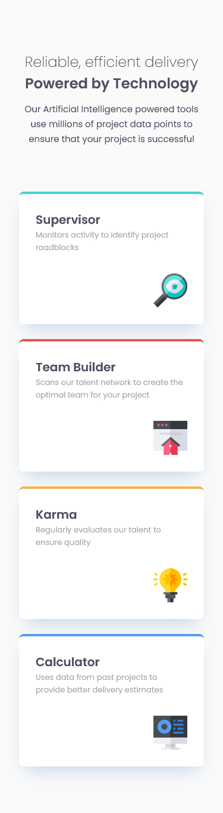

# Frontend Mentor - Four card feature section solution

This is a solution to the [Four card feature section challenge on Frontend Mentor](https://www.frontendmentor.io/challenges/four-card-feature-section-weK1eFYK). Frontend Mentor challenges help you improve your coding skills by building realistic projects.

## Table of contents

- [Overview](#overview)
  - [The challenge](#the-challenge)
  - [Screenshot](#screenshot)
  - [Links](#links)
- [My process](#my-process)
  - [Built with](#built-with)
  - [What I learned](#what-i-learned)
  - [Continued development](#continued-development)
  - [Useful resources](#useful-resources)
- [Author](#author)
- [Acknowledgments](#acknowledgments)

**Note: Delete this note and update the table of contents based on what sections you keep.**

## Overview

### The challenge

Users should be able to:

- View the optimal layout for the site depending on their device's screen size

### Links

- Live Site URL: [Site on Vercel](https://four-card-section-jet.vercel.app/)

### Screenshots

**Desktop:**



**Tablet:**



**Mobile:**



## My process

### Built with

- Semantic HTML5 markup
- CSS custom properties
- CSS Grid
- CSS Modules
- Mobile-first workflow
- TypeScript
- [React](https://reactjs.org/) - JS library

### What I learned

- I learned a lot about how grids are working and how to manipulate its children.

  ```css
  .container {
    display: grid;
    grid-template-columns: 1fr;
    height: auto;
    row-gap: 25px;
    place-items: center;
  }

  @media only screen and (min-width: 756px) {
    .container {
      max-width: 760px;
      gap: 30px;
      grid-template-columns: 1fr 1fr;
    }
  }

  @media only screen and (min-width: 1279px) {
    .container {
      max-width: 1110px;
      gap: 30px;
      grid-template-rows: 1fr 1fr;
      grid-template-columns: 1fr 1fr 1fr;
    }

    .container > :nth-child(1) {
      grid-column: 1 / 2;
    }

    .container > :nth-child(4) {
      grid-column: 3 / 4;
    }

    .container > :nth-child(1),
    .container > :nth-child(4) {
      grid-row: 1 / 3;
    }
  }
  ```

- React18 has no more default properties for components and you have to declare them. That was one more thing I learned.

  ```js
  type GridProps = {
    children: ReactNode,
  };

  const Grid = ({ children }: GridProps) => {
    return <div className={styles.container}>{children}</div>;
  };
  ```

- I learned how I can [deploy a React App with Github Pages](https://github.com/gitname/react-gh-pages)

## Author

- Website - [Sebastian Heitmann](https://www.sebastian-heitmann.dev) (**WIP**)
- Frontend Mentor - [@don_heidi](https://www.frontendmentor.io/profile/DonHeidi)

# Getting Started with Create React App

This project was bootstrapped with [Create React App](https://github.com/facebook/create-react-app).

## Available Scripts

In the project directory, you can run:

### `npm start`

Runs the app in the development mode.\
Open [http://localhost:3000](http://localhost:3000) to view it in the browser.

The page will reload if you make edits.\
You will also see any lint errors in the console.

### `npm test`

Launches the test runner in the interactive watch mode.\
See the section about [running tests](https://facebook.github.io/create-react-app/docs/running-tests) for more information.

### `npm run build`

Builds the app for production to the `build` folder.\
It correctly bundles React in production mode and optimizes the build for the best performance.

The build is minified and the filenames include the hashes.\
Your app is ready to be deployed!

See the section about [deployment](https://facebook.github.io/create-react-app/docs/deployment) for more information.

### `npm run eject`

**Note: this is a one-way operation. Once you `eject`, you can’t go back!**

If you aren’t satisfied with the build tool and configuration choices, you can `eject` at any time. This command will remove the single build dependency from your project.

Instead, it will copy all the configuration files and the transitive dependencies (webpack, Babel, ESLint, etc) right into your project so you have full control over them. All of the commands except `eject` will still work, but they will point to the copied scripts so you can tweak them. At this point you’re on your own.

You don’t have to ever use `eject`. The curated feature set is suitable for small and middle deployments, and you shouldn’t feel obligated to use this feature. However we understand that this tool wouldn’t be useful if you couldn’t customize it when you are ready for it.

## Learn More

You can learn more in the [Create React App documentation](https://facebook.github.io/create-react-app/docs/getting-started).

To learn React, check out the [React documentation](https://reactjs.org/).
